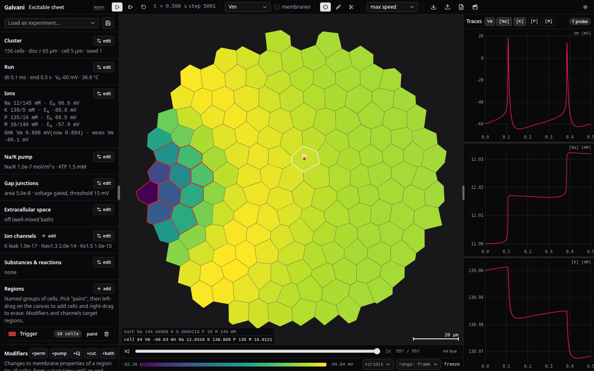
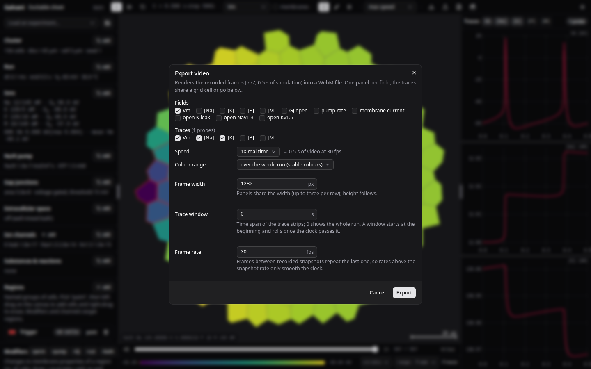
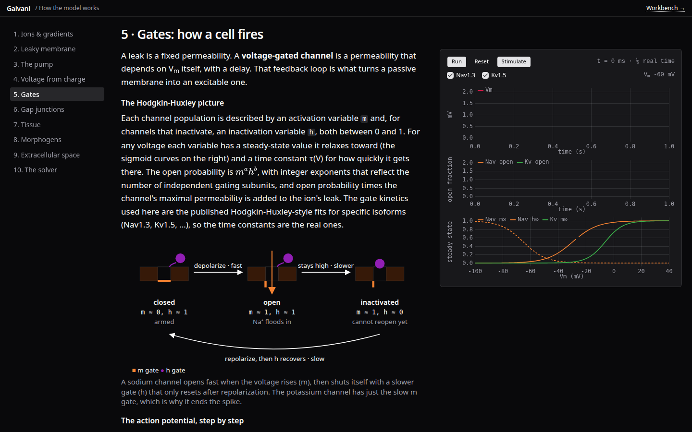

# Galvani

A browser reimplementation of [BETSE](https://github.com/betsee/betse)'s bioelectric
tissue model. A 2D cluster of cells with ion concentrations, membrane voltage, pumps,
gap junctions, voltage-gated channels, substance/gene networks and an optional
extracellular space, solved in a web worker and matched to BETSE at round-off on
parity fixtures.



- **Workbench** (`/`): presets, cluster editing, named regions with time-windowed
  modifiers, live fields on the cluster, probe traces, scrubbable history, video export.
- **Learn** (`/learn`): ten short chapters on the model, each with a live mini-simulation.

## The model

Everything follows BETSE (Pietak & Levin, 2016), including its loop order and its quirks,
so results can be compared number for number.

**Geometry.** Cells are a jittered hexagonal lattice clipped to a mask (disc, ellipse,
rectangle or a painted bitmap) and turned into Voronoi polygons. Each polygon edge is a
membrane segment with its own area and a partner segment on the neighbouring cell.
Boundary membranes face the bath.

**Ions.** BETSE's basic profile: Na⁺, K⁺, fixed anionic proteins (P) and a mobile
anion (M), with Ca²⁺ in the calcium profile; any ion can be added in the Ions dialog.
Each has a valence, a free diffusivity and a membrane permeability. Concentrations live
per cell, per membrane (for gap-junction flux) and in the bath.

**Membrane voltage.** The membrane is a capacitor: Vm = q / Cm, where q is the net charge
of a cell divided by its surface area. There is no explicit voltage equation; Vm follows
the ion bookkeeping.

**Fluxes per step.**
- Na⁺/K⁺-ATPase with a thermodynamic Michaelis–Menten rate (ATP, ADP, Pi and Vm dependent).
- Goldman–Hodgkin–Katz electrodiffusion through each membrane for every ion.
- Gap junctions: GHK flux between neighbouring cells through a shared junction area,
  with Harris-type voltage gating on the transjunctional voltage.
- Hodgkin–Huxley channels ported from BETSE's library (Nav1.x, Kv1–3, Kir, Cav, HCN, Cl
  and cation leaks): activation/inactivation gates with published rate fits, open
  probability × maximal permeability added to the ion's leak.
- Optional Ca²⁺-ATPase when a Ca ion is present.

**Substances and gene networks.** A port of BETSE's MasterOfNetworks: substances with
production/decay driven by Hill-type regulators, cell-zone reactions, modulators of the
pump and gap junctions, and substance-gated ion permeabilities. Substances diffuse across
membranes, through gap junctions and, when the grid is on, through the extracellular space.

**Extracellular space.** An nx×ny grid over the world. Ions electrodiffuse on the grid
(Nernst–Planck with BETSE's finite-difference conventions), membranes exchange with the
nearest square, tight junctions slow diffusion at the cluster boundary, and the
environment voltage is the screened surface charge (Debye length from the bath) plus a
Laplace solution for voltages applied at the world edges. Off by default: the bath is then
a single well-mixed compartment.

**Regions and modifiers.** A region is a named set of cells. A modifier targets a region
(or all cells) for a time window: permeability value or factor for one ion, pump factor,
gap-junction factor, bath concentration hold, applied edge voltage, or cutting the cells
out of the cluster. Each can be disabled without deleting it.

## The solver

Forward Euler on the ion concentrations, exactly as BETSE does it, with a typical time
step of 0.1 ms. One step:

1. Pump rates from current concentrations and Vm.
2. For each ion: GHK membrane flux, Harris gating update, GHK gap-junction flux.
3. Channel gates advance (implicit update), channel fluxes applied.
4. Network substances react and diffuse; modulators update pump and junction factors.
5. Fluxes scattered to cells, bath (or grid), then across junctions; negatives clamped.
6. Charge → Vm per membrane; with the grid on, the environment voltage is solved
   and subtracted.

An optional initialisation phase runs the system to rest with only permanent modifiers
before the clock starts. The worker records frames for scrubbing as densely as the
recording memory budget allows (every step for small clusters); probe traces are
sampled every step.

Parity is enforced by fixtures dumped from BETSE (`tools/betse/dump_parity.py`) and
replayed in `bun test`: resting cluster, channels, calcium, networks, extracellular grid
with tight junctions, applied voltage, and networks on the grid all agree to ~1e-10 or
better over hundreds of steps.

## Using the workbench

- **Presets** in the "Load an experiment" menu: resting cluster, leaky K⁺ patch, Na⁺ pulse,
  excitable sheet, morphogen gradient, gene network, applied field, wound. Your own are
  saved in the browser, or as JSON via the toolbar.
- **Run / step / reset** in the header. Speed is real-time multiples or "max".
- **Fields**: choose what the cluster colours show (Vm, any ion, environment voltage,
  gap-junction openness, pump rate, membrane current, channel open fraction, substances).
  The colour bar at the bottom picks the colormap and the range mode: per frame, over the
  run, or fixed.
- **Probes**: with the probe tool, click a cell to trace it. Traces appear on the right,
  hover-linked, wheel to zoom time, shift+wheel to zoom values, drag to scrub, middle-drag
  to pan, double-click to reset. Probes added late are backfilled from history.
- **Regions**: "paint" then left-drag on the canvas to add cells, right-drag to erase.
  Attach modifiers in the panel below, each with a start and optional end time.
- **Playback**: the slider below the canvas scrubs recorded frames; "live" returns to the
  running simulation.
- **Extracellular space**: its dialog turns the grid on, sets its resolution and the
  tight/adherens junction factors.
- **Video**: the clapperboard renders the recording to WebM (VP9 via WebCodecs).



Pick fields (one panel each), trace quantities, playback speed, colour range, width,
a trace window (rolling once exhausted) and frame rate. With an even number of items
the traces take a grid cell; with an odd number they go below. Needs a browser with
WebCodecs: Chromium, Safari 16.4+, Firefox 130+.

The experiment is also encoded in the URL hash, so a link reproduces the setup.

## Learn



Ions and the Nernst voltage, the leaky membrane and GHK, the pump, voltage from charge,
gates and the action potential, gap junctions, tissue waves and regions, morphogens and
gene networks, the extracellular space, and what the solver does each step. Each chapter
runs a small model in the page with sliders for the parameters it introduces.

## Develop

```sh
bun install
bun run dev        # http://localhost:5173
bun test           # parity fixtures and unit tests
bun run check      # svelte-check
bun run build      # static site in build/
```

The build is a static SPA (`adapter-static`, learn chapters prerendered). Set
`localStorage.debug = 'galvani:*'` for console diagnostics (video export, history).

Parity fixtures need a BETSE checkout; see the header of `tools/betse/dump_parity.py`.

## Credits

Model and numerics follow BETSE by Alexis Pietak and Michael Levin.

Written with [Claude Code](https://claude.com/claude-code) (Claude Fable 5.1),
directed and reviewed by Alexey Zaytsev.
